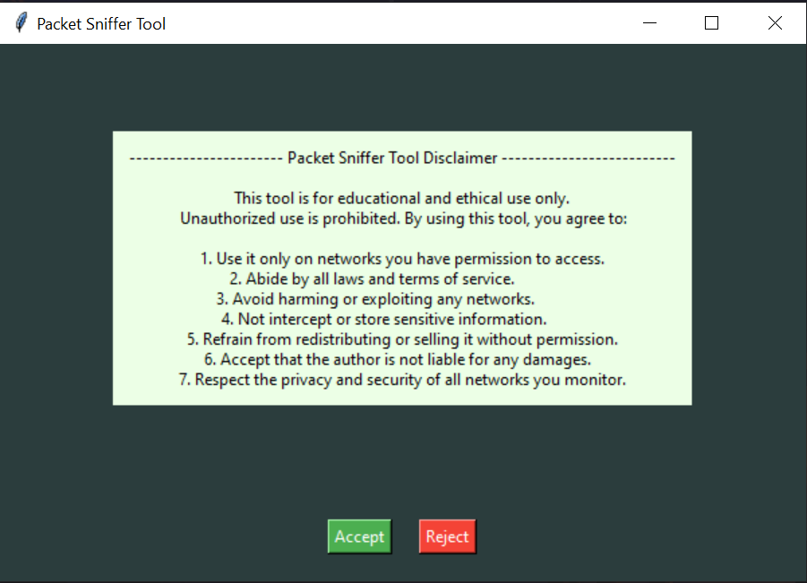

# Packet Sniffer Tool

## Overview

The Packet Sniffer Tool is a graphical user interface (GUI) application built using Python's Tkinter library and Scapy for network packet sniffing. This tool captures and displays network packets with a focus on TCP traffic, allowing users to view source and destination IPs, ports, protocol details, and payload information.

## Features
  - **Disclaimer Agreement:** Users must accept a set of terms before using the tool, ensuring ethical and legal use.
  - **Real-time Packet Sniffing:** Start and stop packet sniffing with the option to clear results.
  - **Display Results:** View captured packet information in a scrollable text area.
  - **Save Results:** Results are saved to a file named `packet_sniffer_results.txt`.

## Installation

  1.Ensure you have Python installed (preferably Python 3.6 or newer).
  2.Install the required libraries by running:
      `pip install scapy`
  3.Save the script as `packet_sniffer_tool.py`.
  
## Usage
  1.**Run the Application:** Execute the script with Python:
      `python packet_sniffer_tool.py`
  2.**Accept Disclaimer:** Read and accept the disclaimer to proceed.
  3.**Start Sniffing:** Click the "Start Sniffing" button to begin capturing packets.
  4.**Stop Sniffing:** Click the "Stop Sniffing" button to stop capturing packets.
  5.**Clear Results:** Click the "Clear Results" button to clear the display area.

## Disclaimer
 > Dont Use this tool for unethical use. Unauthorized use of this tool is prohibited.If you using this tool for unethical activity than devloper does not responsable if you face any problem.

## Troubleshooting

  - **No Packets Captured:** Ensure you have the required permissions and the correct network interface selected. Verify that Scapy and WinPcap (or Npcap) are correctly installed.

##  Screenshot

<p5 align="left">
  
</p5>

  

